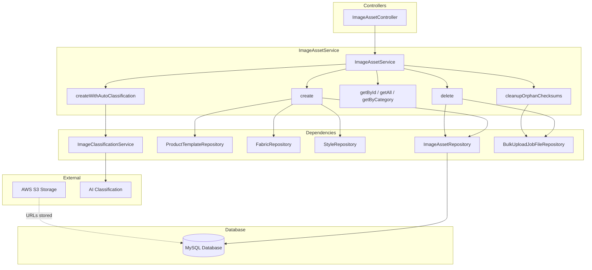
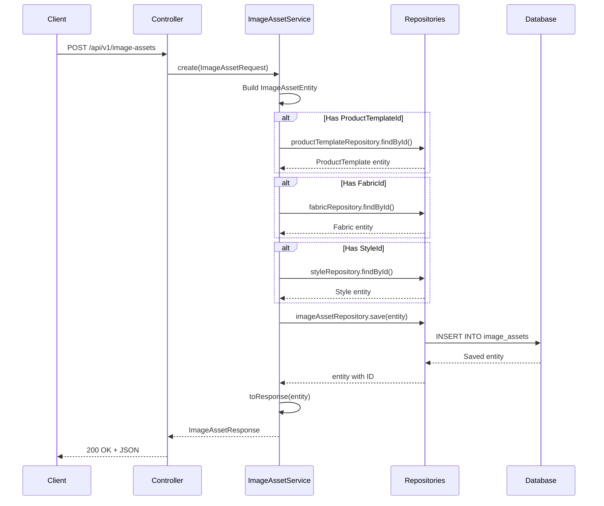
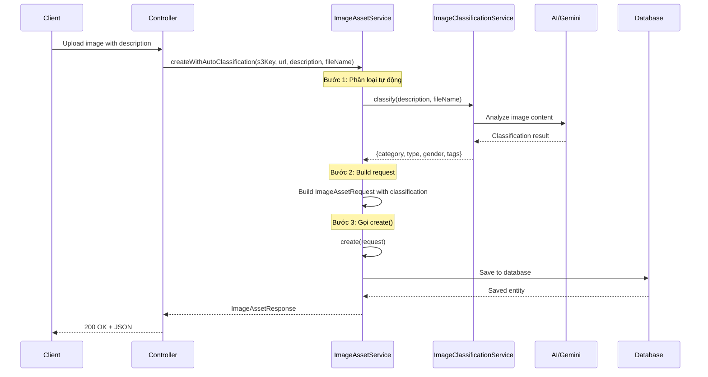
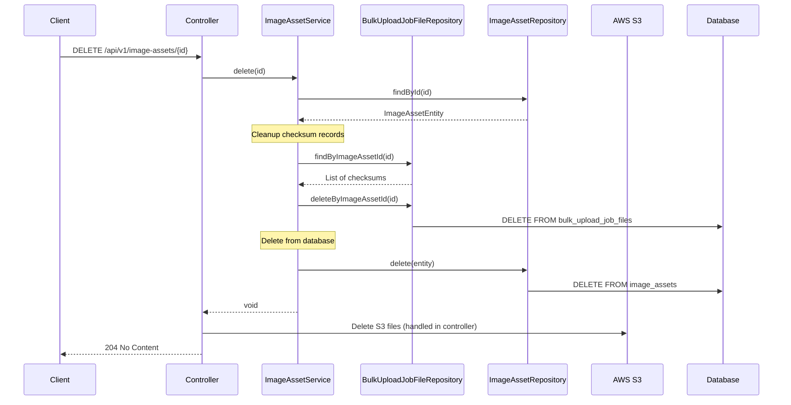
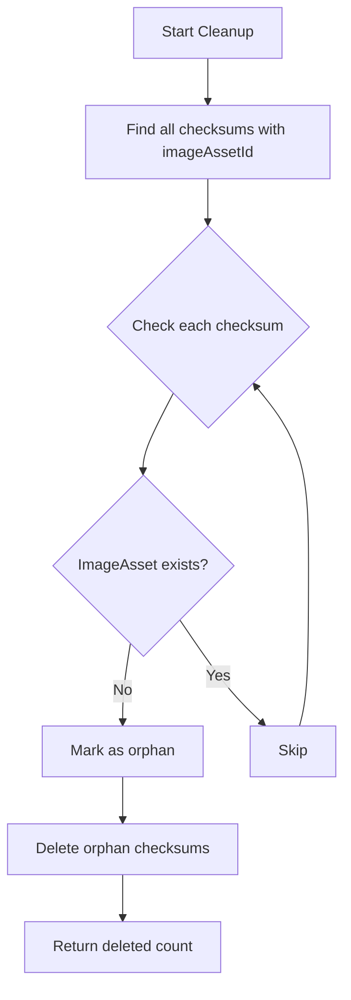

# 📊 ImageAssetService - Sơ Đồ Hoạt Động & Giải Thích

## 1. Tổng Quan Class

`ImageAssetService` là service chịu trách nhiệm quản lý **Image Assets** (tài nguyên hình ảnh) trong hệ thống Tailor Shop. Service này xử lý việc tạo, đọc, xóa ảnh và tích hợp với AI để tự động phân loại ảnh.

---

## 2. Sơ Đồ Kiến Trúc



---

## 3. Sơ Đồ Luồng Tạo Image Asset

### 3.1. Luồng Tạo Thủ Công (`create`)



### 3.2. Luồng Tạo Với Auto Classification (`createWithAutoClassification`)



---

## 4. Sơ Đồ Luồng Xóa Image Asset



---

## 5. Chi Tiết Các Methods

### 5.1. `create(ImageAssetRequest request)`

| Bước | Mô tả |
|------|-------|
| 1 | Nhận request chứa thông tin ảnh (s3Key, url, category, type, gender, tags...) |
| 2 | Build `ImageAssetEntity` từ request |
| 3 | Liên kết với ProductTemplate, Fabric, Style nếu có ID |
| 4 | Lưu entity vào database |
| 5 | Convert entity thành response và trả về |

**Input fields được xử lý:**
- **Basic**: s3Key, url, thumbnailUrl, largeUrl, category, type, gender, tags
- **AI Analysis**: description, occasion, season, styleCategory, silhouette, lengthInfo, lining, accessories, tailoringTime, fittingCount, warranty, materials, colors, occasions, customerStyles, careInstructions, confidence
- **Relations**: productTemplateId, fabricId, styleId

---

### 5.2. `createWithAutoClassification(s3Key, url, description, fileName)`

```
┌──────────────────┐     ┌─────────────────────┐     ┌────────────────┐
│  Input: s3Key,   │ --> │ ImageClassification │ --> │  Build Request │
│  url, desc, file │     │      Service        │     │  with results  │
└──────────────────┘     └─────────────────────┘     └────────────────┘
                                   │                         │
                                   v                         v
                         ┌─────────────────┐        ┌──────────────┐
                         │ Returns:        │        │ Call create()│
                         │ - category      │        │   method     │
                         │ - type          │        └──────────────┘
                         │ - gender        │
                         │ - tags          │
                         └─────────────────┘
```

---

### 5.3. Query Methods

| Method | Mô tả | Parameters |
|--------|-------|------------|
| `getById(Long id)` | Lấy 1 ImageAsset theo ID | id |
| `getAll(Pageable)` | Lấy tất cả có phân trang | pageable |
| `getByCategory(String, Pageable)` | Lọc theo category | category, pageable |
| `getByCategoryAndType(...)` | Lọc theo category + type | category, type, pageable |
| `getByCategoryTypeAndGender(...)` | Lọc theo category + type + gender | category, type, gender, pageable |
| `getByTemplateId(Long)` | Lấy ảnh của 1 ProductTemplate | templateId |

---

### 5.4. `delete(Long id)`

```
        ┌─────────────────┐
        │  Find entity    │
        │  by ID          │
        └────────┬────────┘
                 │
                 v
        ┌─────────────────┐
        │  Delete related │  <-- Cho phép re-upload
        │  checksums      │      cùng file sau này
        └────────┬────────┘
                 │
                 v
        ┌─────────────────┐
        │  Delete entity  │
        │  from database  │
        └────────┬────────┘
                 │
                 v
        ┌─────────────────┐
        │  S3 cleanup     │  <-- Handled by Controller
        │  (separate)     │
        └─────────────────┘
```

---

### 5.5. `cleanupOrphanChecksums()`

Dọn dẹp các checksum mồ côi (orphan) - các record checksum còn tồn tại trong `bulk_upload_job_files` nhưng ImageAsset tương ứng đã bị xóa.



---

## 6. Entity Relationships

```mermaid
erDiagram
    ImageAsset ||--o| ProductTemplate : "belongs to"
    ImageAsset ||--o| Fabric : "belongs to"
    ImageAsset ||--o| Style : "belongs to"
    ImageAsset ||--o{ BulkUploadJobFile : "has checksums"
    
    ImageAsset {
        Long id PK
        String s3Key
        String url
        String thumbnailUrl
        String largeUrl
        String category
        String type
        String gender
        String tags
        String description
        String occasion
        String season
        Long productTemplateId FK
        Long fabricId FK
        Long styleId FK
    }
```

---

## 7. Các Categories và Types Thường Gặp

| Category | Type | Mô tả |
|----------|------|-------|
| `product` | `ao_dai`, `vest`, `dam`, `ao_so_mi` | Sản phẩm may đo |
| `fabric` | `cotton`, `silk`, `linen` | Mẫu vải |
| `style` | `classic`, `modern`, `casual` | Phong cách |
| `model` | `male`, `female` | Ảnh người mẫu |

---

## 8. Tích Hợp AI Classification

Khi sử dụng `createWithAutoClassification`, service sẽ:

1. **Gọi `ImageClassificationService.classify()`** với description và fileName
2. **AI phân tích** nội dung mô tả để xác định:
   - **Category**: Loại sản phẩm (product, fabric, style...)
   - **Type**: Kiểu cụ thể (ao_dai, vest, dam...)
   - **Gender**: Giới tính phù hợp (male, female, unisex)
   - **Tags**: Các tag liên quan

3. **Tự động điền** các trường này vào ImageAsset

---

## 9. Error Handling

| Scenario | Exception |
|----------|-----------|
| ImageAsset không tìm thấy | `RuntimeException("Image asset not found")` |
| Lỗi khi xóa checksum | Log warning, tiếp tục xóa ImageAsset |
| Lỗi cleanup orphan checksums | `RuntimeException` với message chi tiết |

---

## 10. Logging

Service sử dụng `@Slf4j` để log các action quan trọng:

- ✅ `Created ImageAsset ID: {} with type: {}, description: {}`
- ✅ `Deleted ImageAsset with ID: {}`
- 🧹 `Cleanup orphan checksums: found {} orphan checksums, deleted {} records`
- ⚠️ `Failed to delete checksum records for ImageAsset ID {}: {}`
